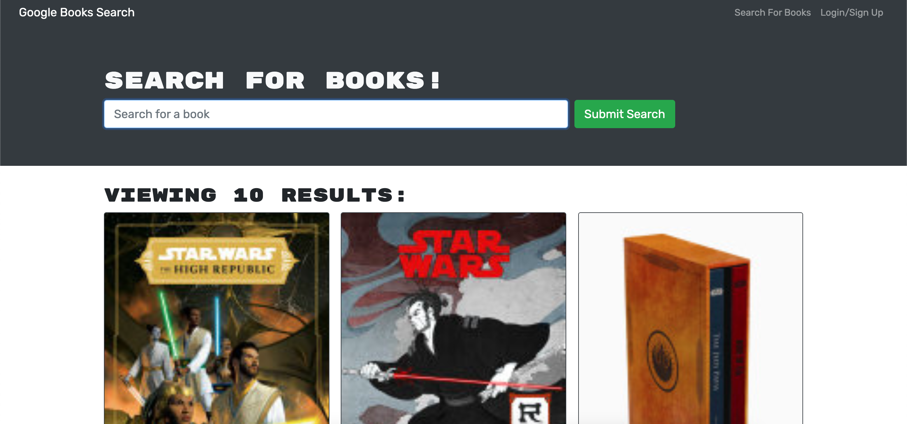

# book-search

## License

#### License Link 🎫

- [License: MIT](LICENSE)

#### Badge 🏆

## Description 📖

- A Google Books API search engine built with GraphQL API in order to get specific data and built with Apollo Server. The app was built using the M.E.R.N. stack, with a React front end in order to provide a multi-page feel for the user. MongoDB backend database, and Node.js/Express.js server and API. It allow's users to save book searches.

## Table of Contents

- [Built-With 🎮](#built-with)
- [Screenshot 🎬](#screenshot)
- [Link 🧑🏻‍💻](#link)
- [Contribution 👾](#contribution)
- [Contact 📟](#contact-me/questions)

## Built With

- Javascript
- MongoDB
- ExpressJS
- React
- NodeJS
- GraphQL
- HTML
- CSS
- Mongoose
- Apollo

## Screenshot

## Link

- [Deployed Link](https://mighty-wave-18723.herokuapp.com/)

## Contribution

This project was successfully built by myself “Kevin Hernandez” and the use of some Google searches and StackOverflow late night questions.

## Contact Me/Questions

- GitHub: [Kevin-Hernandez-Garza](https://github.com/Kevin-Hernandez-Garza)

- Email: [kev.hernandezgarza@gmail.com](mailto:kev.hernandezgarza@gmail.com)

### © Created with 💜 by Kevin Hernandez!
